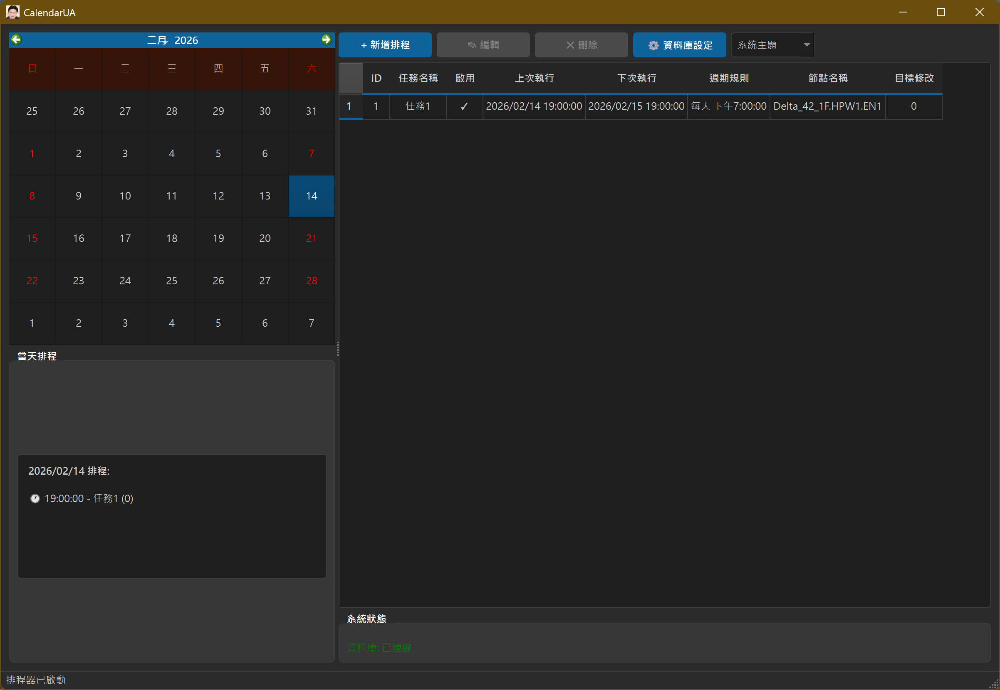
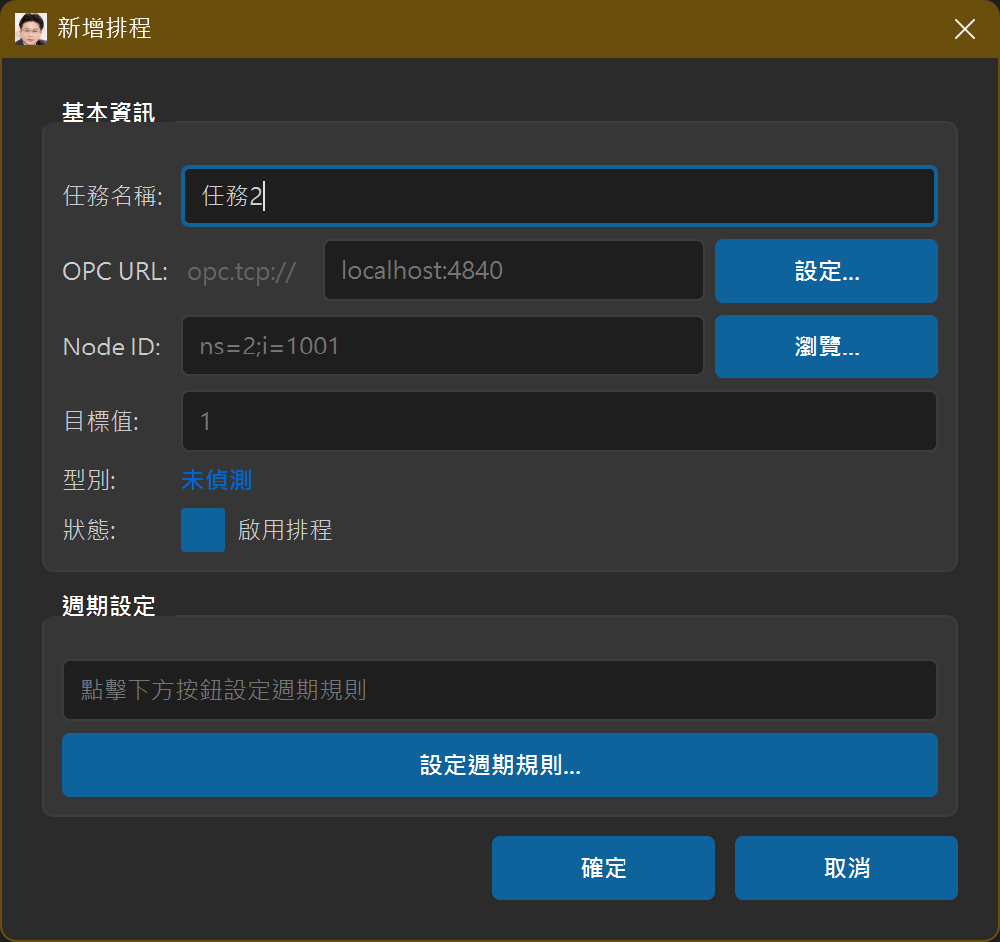
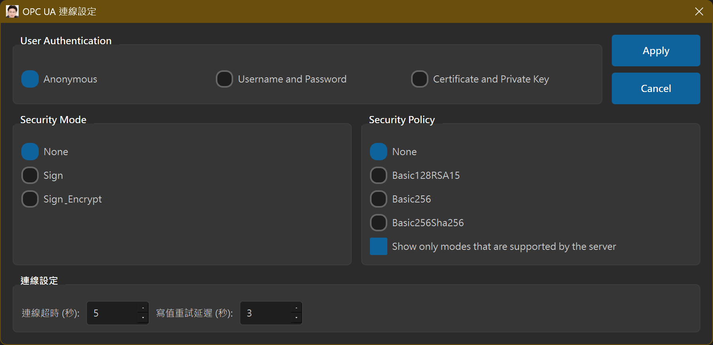
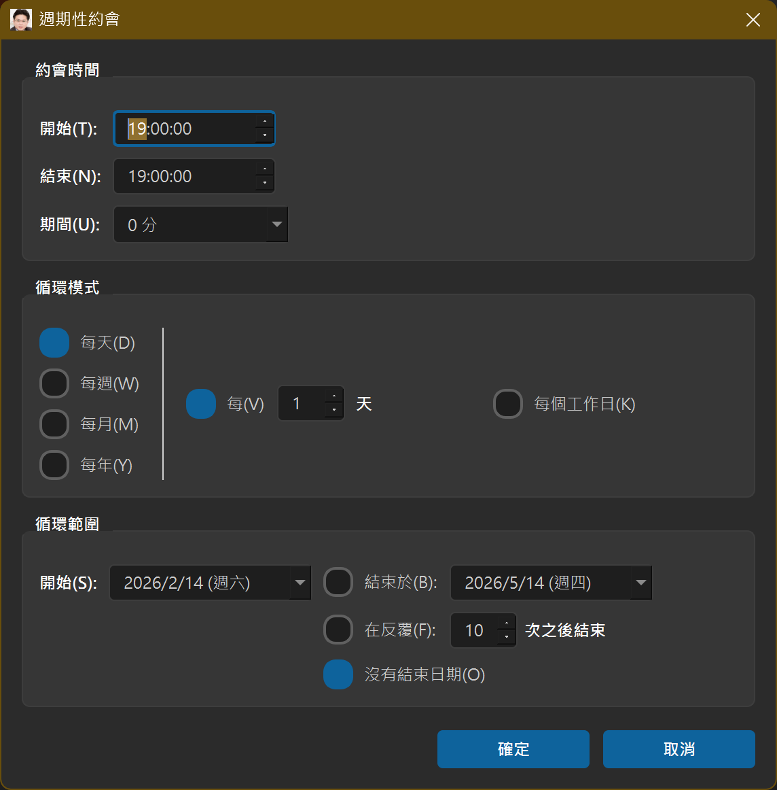
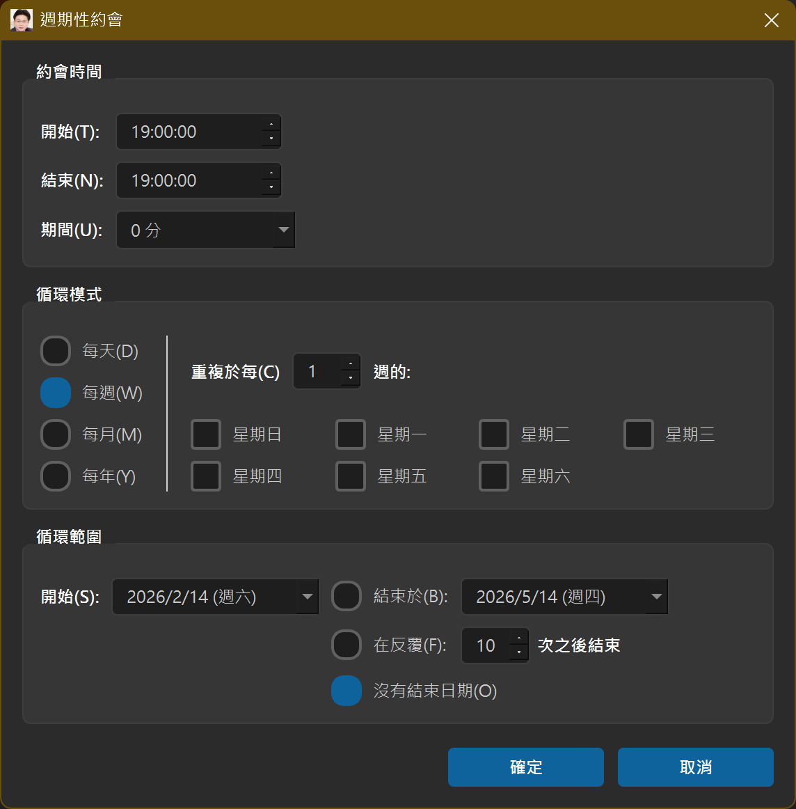
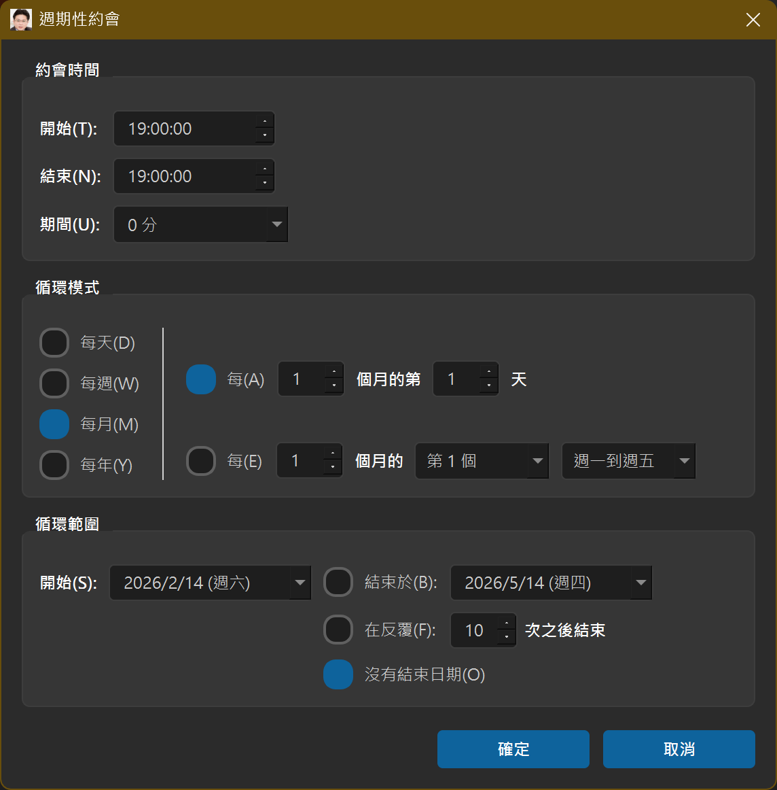
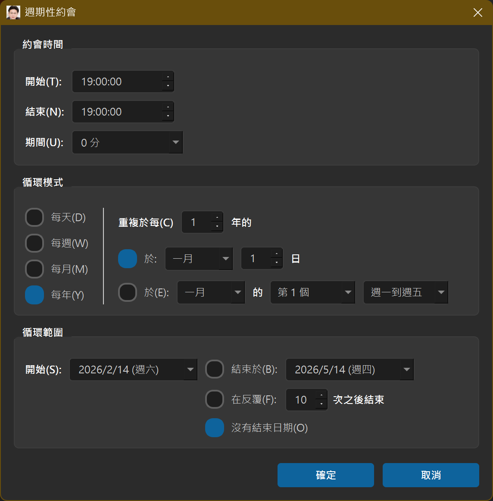

# CalendarUA - 工業自動化排程管理系統

[](https://www.python.org/)
[](LICENSE)
[](https://pypi.org/project/PySide6/)

CalendarUA 是一款專為工業自動化領域設計的智慧排程管理系統，採用現代化 GUI 介面，整合 OPC UA 通訊協定與 RRULE 週期規則，提供企業級的自動化任務排程解決方案。

> 目前主介面分頁為：`General`、`Holidays`、`Exceptions`（已整併舊版 Weekly / Preview / Runtime 入口）。

## 📋 專案概述

本系統專為工業環境設計，能夠精確控制生產設備的啟停時序、參數調整等關鍵操作。系統採用模組化架構，支援多種安全認證方式，並提供直觀的 Office 風格使用者介面。

### 🎯 核心特性

- **📅 智慧行事曆介面**：採用類似 Outlook 的視覺化設計，支援多種檢視模式
- **🔄 靈活週期規則**：完整支援 RFC 5545 RRULE 標準，涵蓋每日、每週、每月、每年等複雜排程
- **🔒 企業級安全**：支援 OPC UA 多種安全策略，包括無加密、基本加密、憑證認證等
- **⚡ 非同步處理**：採用 asyncua 實現高效能 OPC UA 通訊
- **💾 輕量級儲存**：內建 SQLite 資料庫，無需額外伺服器配置
- **🎨 現代化 UI**：支援亮色/暗色主題切換，適配 Windows 11 設計語言
- **🔧 系統整合**：支援系統匣圖示、最小化至托盤等桌面應用功能
- **🔄 智慧重試機制**：支援連線逾時重試和寫值失敗重試，可自訂重試延遲時間

## 🏗️ 系統架構

```
CalendarUA/
├── 📁 core/                 # 核心業務邏輯
│   ├── opc_handler.py       # OPC UA 通訊處理器
│   ├── opc_security_config.py # 安全配置管理
│   └── rrule_parser.py      # RRULE 規則解析器
├── 📁 database/             # 資料持久化層
│   └── sqlite_manager.py    # SQLite 資料庫管理器
├── 📁 ui/                   # 使用者介面層
│   ├── recurrence_dialog.py # 週期設定對話框
│   └── database_settings_dialog.py # 資料庫設定介面
├── 📄 CalendarUA.py         # 主應用程式入口
├── 📄 requirements.txt      # Python 依賴清單
└── 📄 pyproject.toml        # 專案配置檔案
```

### 架構說明

- **展示層 (UI Layer)**：基於 PySide6 的現代化圖形介面
- **業務邏輯層 (Business Layer)**：排程計算、規則解析、安全處理
- **資料存取層 (Data Layer)**：SQLite 資料庫操作與資料模型
- **通訊層 (Communication Layer)**：OPC UA 協定實現與網路處理

## 🚀 快速開始

### 系統需求

- **作業系統**：Windows 10/11, Linux, macOS
- **Python 版本**：3.9 或更新版本
- **記憶體**：至少 512MB RAM
- **儲存空間**：100MB 可用磁碟空間

### 安裝步驟

1. **複製專案**
   ```bash
   git clone https://github.com/lioil1020-JackLee/CalendarUA.git
   cd CalendarUA
   ```

2. **建立虛擬環境**
   ```bash
   python -m venv .venv
   # Windows
   .venv\Scripts\activate
   # Linux/macOS
   source .venv/bin/activate
   ```

3. **安裝依賴**
   ```bash
   pip install -r requirements.txt
   ```

4. **啟動應用程式**
   ```bash
   python CalendarUA.py
   ```

### 首次設定

1. 啟動後，系統會自動建立預設資料庫
2. 點擊「資料庫設定」配置資料庫路徑（如需要）
3. 新增您的第一個排程任務

## 🎨 介面預覽

### 主視窗介面


*主視窗展示行事曆視圖和任務列表，支援拖拽操作和右鍵選單*

### 資料庫設定


*資料庫設定介面支援自訂資料庫路徑和統計資訊查看*

## 📖 使用指南

### 建立排程任務

#### 1. 新增排程任務


*新增排程對話框：設定基本任務資訊*

#### 2. OPC UA 連線設定


*OPC UA 安全配置：設定連線參數和認證資訊*

#### 3. 瀏覽 OPC UA 節點


*OPC UA 節點瀏覽器：選擇要控制的節點*

#### 4. 編輯排程任務


*編輯排程介面：修改現有任務設定*

### 管理現有任務

- **啟用/停用**：右鍵選單快速切換任務狀態
- **編輯任務**：雙擊任務或使用編輯按鈕
- **刪除任務**：選取任務後點擊刪除按鈕
- **檢視日曆**：在左側日曆中查看任務分佈

#### 任務管理介面


*任務管理介面：支援右鍵選單操作、任務狀態切換和日曆視圖*

### 資料庫管理

系統提供完整的資料庫管理功能：

- **路徑設定**：變更資料庫儲存位置
- **資料備份**：匯出資料庫檔案
- **資料還原**：從備份檔案恢復資料
- **統計資訊**：查看任務數量、執行記錄等

## 🔧 技術規格

### 支援的 RRULE 參數

| 參數 | 說明 | 支援狀態 |
|------|------|----------|
| FREQ | 重複頻率 (DAILY/WEEKLY/MONTHLY/YEARLY) | ✅ 完整支援 |
| INTERVAL | 重複間隔 | ✅ 支援 |
| BYDAY | 星期幾指定 | ✅ 支援 |
| BYMONTHDAY | 月份日期 | ✅ 支援 |
| BYMONTH | 月份 | ✅ 支援 |
| BYSETPOS | 集合位置 | ✅ 支援 |
| BYHOUR/BYMINUTE | 時間設定 | ✅ 支援 |
| COUNT | 重複次數 | ✅ 支援 |
| UNTIL | 結束日期 | ✅ 支援 |
| DTSTART | 開始時間 | ✅ 支援 |
| DURATION | 持續時間 (自訂) | ✅ 支援 |

### 週期規則介面預覽

系統提供直觀的週期設定介面，支援多種重複模式：

#### 每日排程設定


#### 每週排程設定


#### 每月排程設定


#### 每年排程設定


### OPC UA 安全支援

| 安全策略 | 說明 | 支援狀態 |
|----------|------|----------|
| None | 無加密 | ✅ 支援 |
| Basic256Sha256 | 256位元加密 | ✅ 支援 |
| Basic128Rsa15 | 128位元加密 | ❌ 不支援 |
| Basic256 | 256位元加密 | ❌ 不支援 |

### 認證方式

- **匿名認證**：適用於測試環境
- **使用者名稱/密碼**：標準認證方式
- **X.509 憑證**：企業級安全認證

### 重試機制

| 參數 | 說明 | 預設值 |
|------|------|--------|
| 連線超時 | OPC UA 連線逾時時間 | 5 秒 |
| 寫值重試延遲 | 寫值失敗後重試間隔 | 3 秒 |
| 重試策略 | 根據持續時間決定重試行為 | 持續時間 > 0 分鐘時重試 |

## 📊 資料庫結構

### schedules 表格

| 欄位名稱 | 資料型態 | 說明 | 約束 |
|----------|----------|------|------|
| id | INTEGER | 主鍵 | PRIMARY KEY AUTOINCREMENT |
| task_name | TEXT | 任務名稱 | NOT NULL |
| opc_url | TEXT | OPC UA 伺服器位址 | NOT NULL |
| node_id | TEXT | OPC UA 節點 ID | NOT NULL |
| target_value | TEXT | 目標數值 | NOT NULL |
| rrule_str | TEXT | RRULE 規則字串 | NOT NULL |
| opc_security_policy | TEXT | 安全策略 | DEFAULT 'None' |
| opc_security_mode | TEXT | 安全模式 | DEFAULT 'None' |
| opc_username | TEXT | 使用者名稱 |  |
| opc_password | TEXT | 密碼 |  |
| opc_timeout | INTEGER | 連線超時(秒) | DEFAULT 5 |
| opc_write_timeout | INTEGER | 寫值重試延遲(秒) | DEFAULT 3 |
| is_enabled | INTEGER | 啟用狀態 | DEFAULT 1 |
| created_at | TIMESTAMP | 建立時間 | DEFAULT CURRENT_TIMESTAMP |
| updated_at | TIMESTAMP | 更新時間 | DEFAULT CURRENT_TIMESTAMP |

## 🔍 故障排除

### 常見問題

**Q: 應用程式啟動失敗**
A: 確認 Python 版本 ≥ 3.9，並已安裝所有依賴套件

**Q: OPC UA 連線失敗**
A: 檢查伺服器位址、網路連線和安全設定。連線逾時預設為 5 秒，可在任務設定中調整

**Q: 排程未執行**
A: 確認任務已啟用，且 RRULE 規則設定正確

**Q: 寫值失敗**
A: 檢查 Node ID 是否正確，寫值重試延遲預設為 3 秒，可在任務設定中調整

**Q: 資料庫錯誤**
A: 檢查資料庫檔案權限，或嘗試重新建立資料庫

### 記錄與除錯

系統預設記錄等級為 WARNING。如需詳細記錄，請修改 `CalendarUA.py` 中的記錄設定：

```python
logging.basicConfig(level=logging.DEBUG)
```

## 🤝 貢獻指南

歡迎參與專案開發！請遵循以下步驟：

1. Fork 此專案
2. 建立功能分支 (`git checkout -b feature/AmazingFeature`)
3. 提交變更 (`git commit -m 'Add some AmazingFeature'`)
4. 推送至分支 (`git push origin feature/AmazingFeature`)
5. 開啟 Pull Request

### 開發環境設定

```bash
# 安裝開發依賴
pip install -e ".[dev]"

# 執行測試
python -m pytest

# 建置可執行檔案
pyinstaller CalendarUA.spec
```

## 📄 授權條款

本專案採用 MIT 授權條款 - 詳見 [LICENSE](LICENSE) 檔案

## 📞 聯絡資訊

- **專案維護者**: [lioil1020-JackLee](https://github.com/lioil1020-JackLee)
- **問題回報**: [GitHub Issues](https://github.com/lioil1020-JackLee/CalendarUA/issues)
- **專案首頁**: [GitHub Repository](https://github.com/lioil1020-JackLee/CalendarUA)

---

**注意**: 本系統適用於工業自動化環境，請在專業人員指導下使用。如有特殊需求或客製化需求，請聯絡開發團隊。