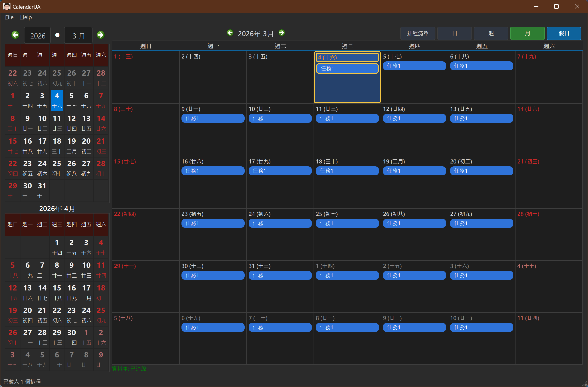
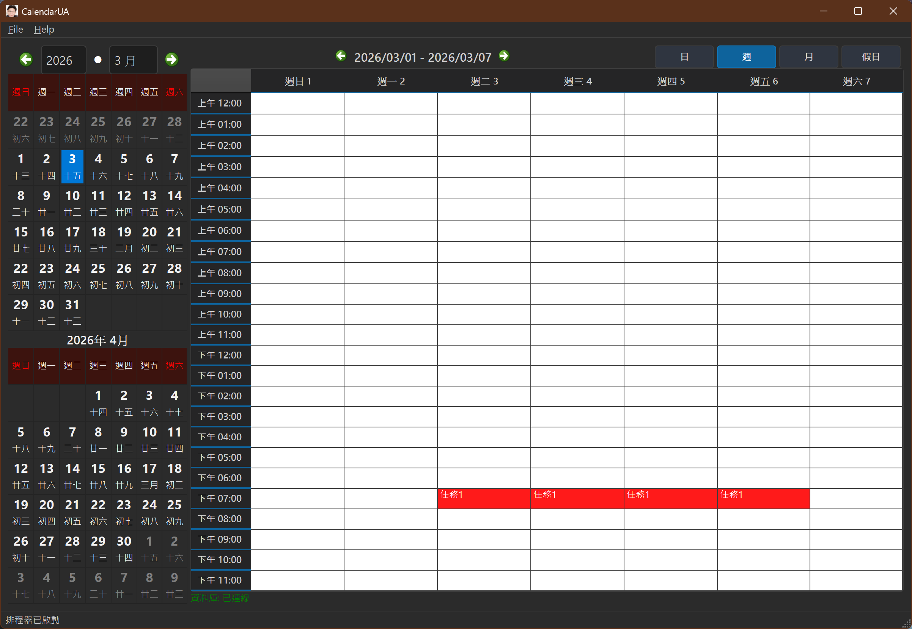
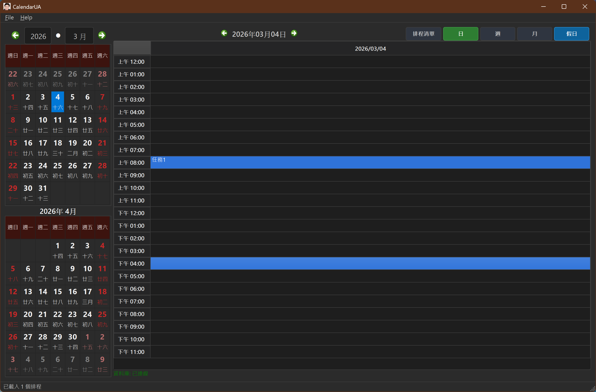
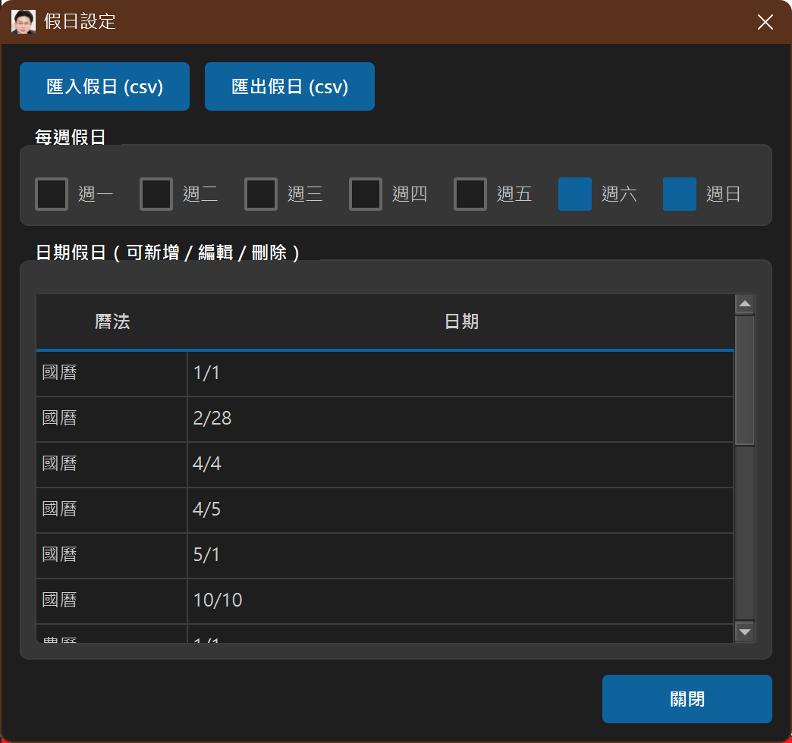
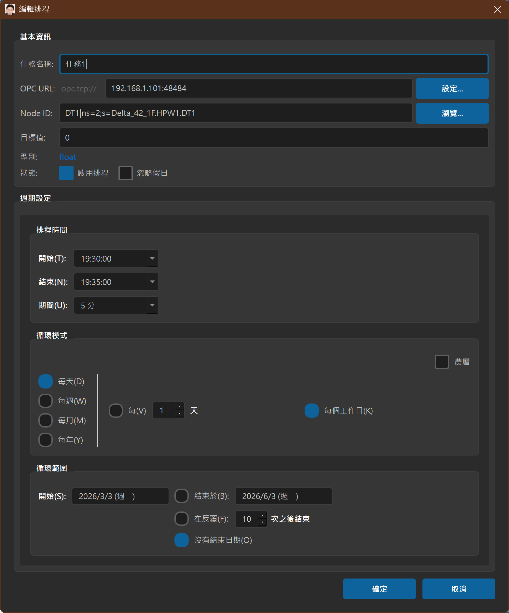
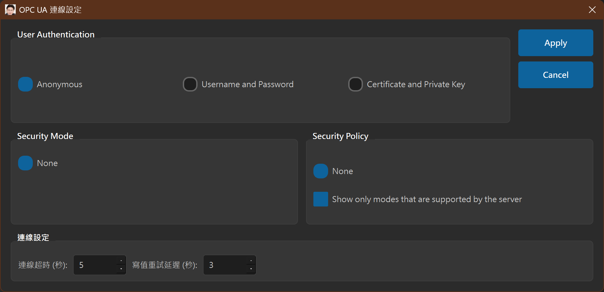
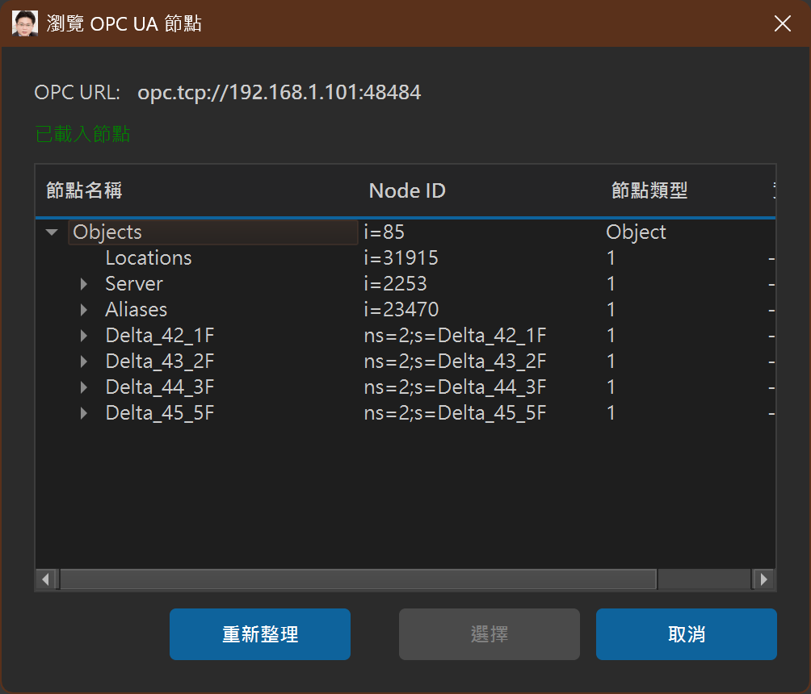
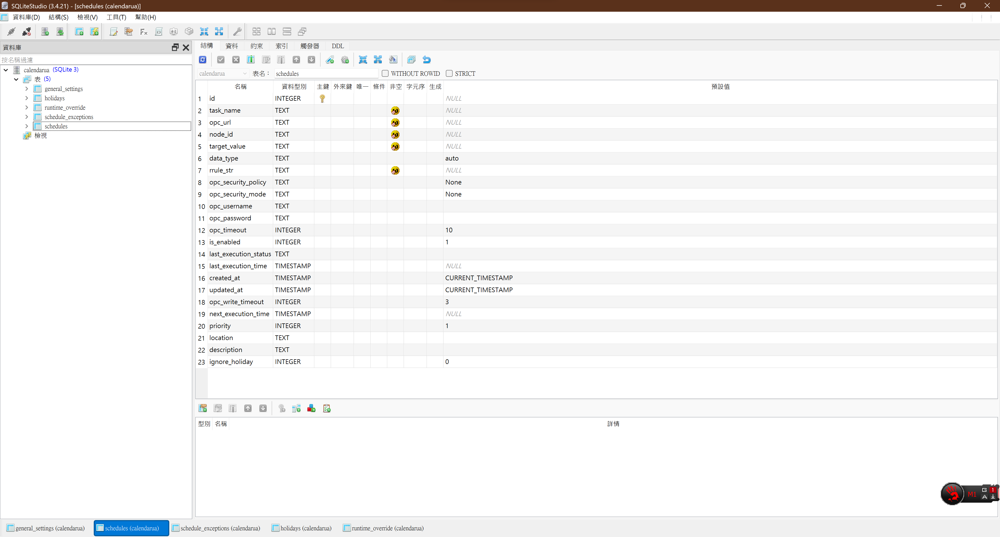

# CalendarUA










CalendarUA 是一套以 `PySide6` 開發的 OPC UA 排程桌面工具，提供日/週/月行事曆視圖、RRULE 週期排程、例外與假日規則、以及 SQLite 本地資料庫。

## 核心功能

- 日 / 週 / 月視圖（含拖曳/右鍵互動）
- RRULE 週期排程（含 `DURATION`）
- 排程例外（取消或覆寫單次 occurrence）
- 假日規則（每週假日 + 國曆/農曆月日）
- 假日設定匯入/匯出（CSV）
- OPC UA 連線與寫值（含安全模式/帳密）
- 排程項目 `忽略假日` 開關

## 專案結構

```text
CalendarUA/
├─ CalendarUA.py
├─ core/
│  ├─ lunar_calendar.py
│  ├─ opc_handler.py
│  ├─ rrule_parser.py
│  ├─ schedule_models.py
│  └─ schedule_resolver.py
├─ database/
│  └─ sqlite_manager.py
├─ ui/
│  ├─ database_settings_dialog.py
│  ├─ holiday_settings_dialog.py
│  ├─ month_grid.py
│  ├─ recurrence_dialog.py
│  └─ schedule_canvas.py
├─ docs/
│  └─ db_schema.md
├─ requirements.txt
├─ pyproject.toml
├─ CalendarUA-onedir.spec
└─ CalendarUA-onefile.spec
```

## 環境需求

- Python `>= 3.10`
- 建議使用 `uv`
- Windows 11（主要開發/測試環境）

## 安裝與執行

### 1) 使用 uv（建議）

```bash
uv sync --dev
uv run python CalendarUA.py
```

### 2) 使用 pip

```bash
pip install -r requirements.txt
python CalendarUA.py
```

## 假日設定說明

主視窗右上「日 / 週 / 月 / 假日」中的 `假日` 按鈕可開啟假日設定。

- 每週假日：週一到週日 checkbox（勾選即自動存入 DB）
- 日期假日：表格右鍵選單新增 / 編輯 / 刪除
- 日期型規則支援：
  - 國曆（月/日）
  - 農曆（月/日）
- CSV 匯入/匯出格式欄位：
  - `entry_type,calendar_type,month,day,weekday`

## 資料庫

- 預設檔案：`database/calendarua.db`
- 主要資料表：
  - `schedules`
  - `schedule_exceptions`
  - `holidays`
  - `general_settings`
  - `runtime_override`

詳細請見：`docs/db_schema.md`

## 打包（PyInstaller）

### onedir

```bash
uv run pyinstaller --clean --noconfirm CalendarUA-onedir.spec
```

輸出資料夾：`dist/CalendarUA-onedir/`

### onefile

```bash
uv run pyinstaller --clean --noconfirm CalendarUA-onefile.spec
```

輸出檔案：`dist/CalendarUA-onefile.exe`

## 常見開發指令

```bash
# 語法檢查
uv run python -m py_compile CalendarUA.py core/*.py database/*.py ui/*.py

# 重新安裝依賴
uv sync --dev
```

## 備註

- 行事曆的假日命中邏輯由 `core/schedule_resolver.py` 負責。
- 若排程勾選 `忽略假日`，該排程 occurrence 不套用假日覆寫。
